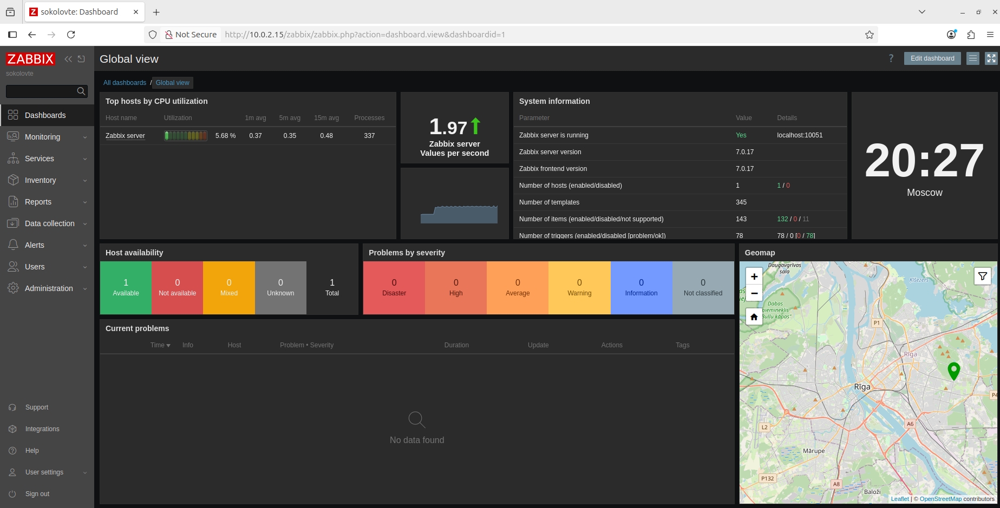
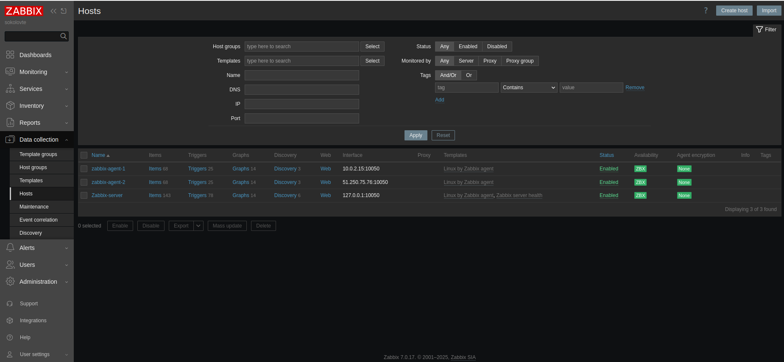
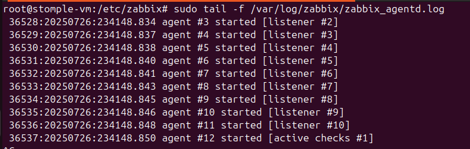
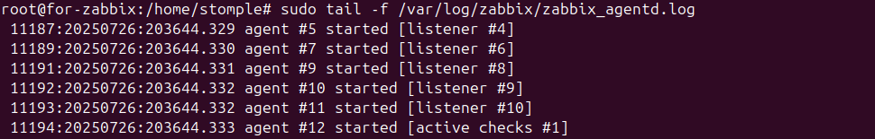
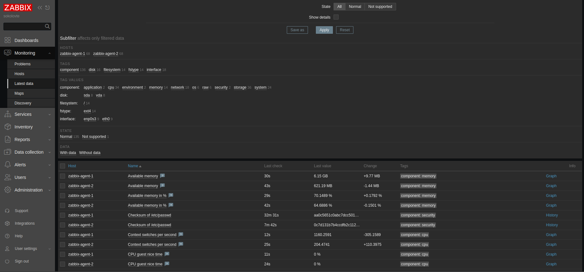

# Домашнее задание к занятию "`Система мониторинга Zabbix`" - `Соколов Тимофей`


### Инструкция по выполнению домашнего задания

   1. Сделайте `fork` данного репозитория к себе в Github и переименуйте его по названию или номеру занятия, например, https://github.com/имя-вашего-репозитория/git-hw или  https://github.com/имя-вашего-репозитория/7-1-ansible-hw).
   2. Выполните клонирование данного репозитория к себе на ПК с помощью команды `git clone`.
   3. Выполните домашнее задание и заполните у себя локально этот файл README.md:
      - впишите вверху название занятия и вашу фамилию и имя
      - в каждом задании добавьте решение в требуемом виде (текст/код/скриншоты/ссылка)
      - для корректного добавления скриншотов воспользуйтесь [инструкцией "Как вставить скриншот в шаблон с решением](https://github.com/netology-code/sys-pattern-homework/blob/main/screen-instruction.md)
      - при оформлении используйте возможности языка разметки md (коротко об этом можно посмотреть в [инструкции  по MarkDown](https://github.com/netology-code/sys-pattern-homework/blob/main/md-instruction.md))
   4. После завершения работы над домашним заданием сделайте коммит (`git commit -m "comment"`) и отправьте его на Github (`git push origin`);
   5. Для проверки домашнего задания преподавателем в личном кабинете прикрепите и отправьте ссылку на решение в виде md-файла в вашем Github.
   6. Любые вопросы по выполнению заданий спрашивайте в чате учебной группы и/или в разделе “Вопросы по заданию” в личном кабинете.
   
Желаем успехов в выполнении домашнего задания!
   
### Дополнительные материалы, которые могут быть полезны для выполнения задания

1. [Руководство по оформлению Markdown файлов](https://gist.github.com/Jekins/2bf2d0638163f1294637#Code)

—

### Задание 1

`Приведите ответ в свободной форме........`

```

1) sudo -s 
2) apt install postgresql
3) apt update
4) wget https://repo.zabbix.com/zabbix/6.0/ubuntu/pool/main/z/zabbix-release/zabbix-release_latest_6.0+ubuntu24.04_all.deb
5) dpkg -i zabbix-release_latest_6.0+ubuntu24.04_all.deb
6) apt update
7) apt install zabbix-server-pgsql zabbix-frontend-php php8.3-pgsql zabbix-apache-conf zabbix-sql-scripts
8) sudo -u postgres createuser --pwprompt zabbix
9) sudo -u postgres createdb -O zabbix zabbix
10) zcat /usr/share/zabbix-sql-scripts/postgresql/server.sql.gz | sudo -u zabbix psql zabbix
11) nano /etc/zabbix/zabbix_server.conf - DBPassword=добавил свой пароль 
12) systemctl restart zabbix-server zabbix-agent apache2
13) systemctl enable zabbix-server zabbix-agent apache2
14) зашёл на http://мой_ip/zabbix


`При необходимости прикрепитe сюда скриншоты




—

### Задание 2

`Приведите ответ в свободной форме........`

1) Запустил вторую нашину на yandex cloud и подключился к ней по ssh
2) sudo apt update
3) sudo -s
4) wget https://repo.zabbix.com/zabbix/6.0/ubuntu/pool/main/z/zabbix-release/zabbix-release_latest_6.0+ubuntu24.04_all.deb
5) dpkg -i zabbix-release_latest_6.0+ubuntu24.04_all.deb
6) apt update
7) apt install zabbix-agent
8) systemctl restart zabbix-agent
9) systemctl enable zabbix-agent 

10) Затем осталось только настроить agentd.conf на обеих машинах. Добавил туда Server=указал ip, обновил страницу на веб zabbix, отправил каждому по задаче и они загорелись зеленым.

`При необходимости прикрепитe сюда скриншоты





